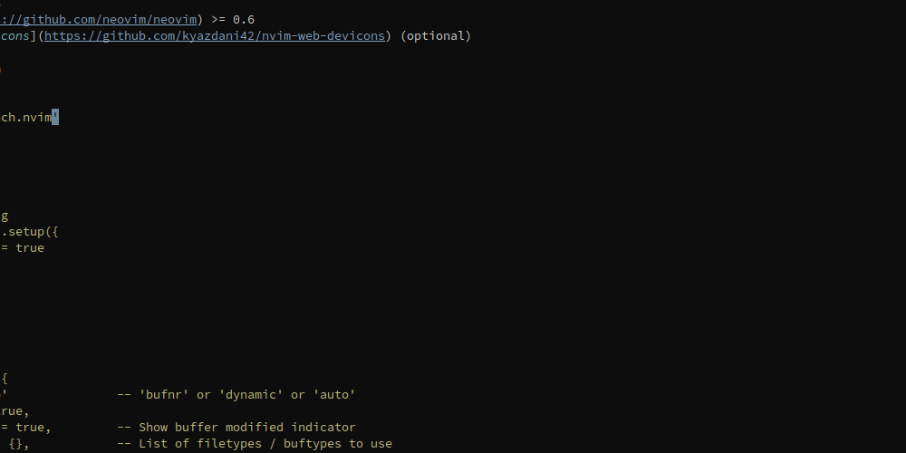

# reach.nvim

buffer / mark / tabpage / colorscheme switcher for [Neovim](https://github.com/neovim/neovim).



### Requirements
- [Neovim](https://github.com/neovim/neovim) >= 0.6
- [nvim-web-devicons](https://github.com/kyazdani42/nvim-web-devicons) (optional)

### Installation

```lua
use 'toppair/reach.nvim'
```

### Usage

```lua
-- default config
require('reach').setup({
  notifications = true
})
```

#### buffers

```lua
-- default
local options = {
  handle = 'auto'               -- 'bufnr' or 'dynamic' or 'auto'
  show_icons = true,
  show_current = false,         -- Include current buffer in the list
  show_modified = true,         -- Show buffer modified indicator
  modified_icon = '⬤'           -- Character to use as modified indicator
  grayout_current = true        -- Wheter to gray out current buffer entry
  force_delete = {},            -- List of filetypes / buftypes to use
                                -- 'bdelete!' on, e.g. { 'terminal' }
  filter = nil,                 -- Function taking bufnr as parameter,
                                -- returning true or false
  sort = nil,                   -- Comparator function (bufnr, bufnr) -> bool
  terminal_char = '\\',         -- Character to use for terminal buffer handles
                                -- when options.handle is 'dynamic'
  grayout = true,               -- Gray out non matching entries
  auto_exclude_handles = {},    -- A list of characters not to use as handles when
                                -- options.handle == 'auto', e.g. { '8', '9', 'j', 'k' }
  previous = {
    enable = true,              -- Mark last used buffers with specified chars and colors
    depth = 2,                  -- Maximum number of buffers to mark
    chars = { '•' },            -- Characters to use as markers,
                                -- last one is used when depth > #chars
    groups = {                  -- Highlight groups for markers,
      'String'                  -- last one is used when depth > #groups
      'Comment'
    },
  },
}

require('reach').buffers(options)
```

or command with default options applied:

```
ReachOpen buffers
```

When window is open:

- type in the buffer handle to switch to that buffer, `<CR>` required if `options.handle` == 'bufnr' and there are further matches
- press `<Space>` to start deleting buffers, if `options.handle` == 'bufnr' a prompt accepting space separated list of bufnrs is displayed
- press `|` to split buffer vertically
- press `-` to split buffer horizontally
- press `]` to open buffer in a new tab

If `options.handle` == 'auto':

- press `=` to start assigning priorities to buffers. Buffers with higher priority (1 is higher priority than 2) will have their handles assigned first. This is persistent for each `cwd`. Set priority to `<Space>` to remove it.

#### marks

```lua
-- default
local options = {
  filter = function(mark)
    return mark:match('[a-zA-Z]') -- return true to disable
  end,
}

require('reach').marks(options)
```

or command with default options applied:

```
ReachOpen marks
```

When window is open:
- type in the mark handle to jump to that mark
- press `<Space>` to start deleting marks
- press `|` to split mark vertically
- press `-` to split mark horizontally
- press `]` to open mark in a new tab

#### tabpages

```lua
-- default
local options = {
  show_icons = true,
  show_current = false,
}

require('reach').tabpages(options)
```

or command with default options applied:

```
ReachOpen tabpages
```

When window is open:
- type in the tabpage number to switch to that tabpage
- press `<Space>` to start deleting tabpages

#### colorschemes

```lua
-- default
local options = {
  filter = (function()
    local default = {
      'blue', 'darkblue', 'default', 'delek', 'desert', 'elflord', 'evening', 'industry', 'koehler',
      'morning', 'murphy', 'pablo', 'peachpuff', 'ron', 'shine', 'slate', 'torte', 'zellner',
    }

    return function(name)
      return not vim.tbl_contains(default, name) -- return true to disable
    end
  end)(),
}

require('reach').colorschemes(options)
```

or command with default options applied:

```
ReachOpen colorschemes
```

When window is open:
- type in the colorscheme handle to set it

### Highlights

```
ReachBorder             -> 'Comment',
ReachDirectory          -> 'Directory',
ReachModifiedIndicator  -> 'String',
ReachHandleBuffer       -> 'String',
ReachHandleDelete       -> 'Error',
ReachHandleSplit        -> 'Directory',
ReachTail               -> 'Normal',
ReachHandleMarkLocal    -> 'Type',
ReachHandleMarkGlobal   -> 'Number',
ReachMark               -> 'Normal',
ReachMarkLocation       -> 'Comment',
ReachHandleTabpage      -> 'TabLineSel',
ReachGrayOut            -> 'Comment',
ReachMatchExact         -> 'String',
ReachPriority           -> 'Special',
```
